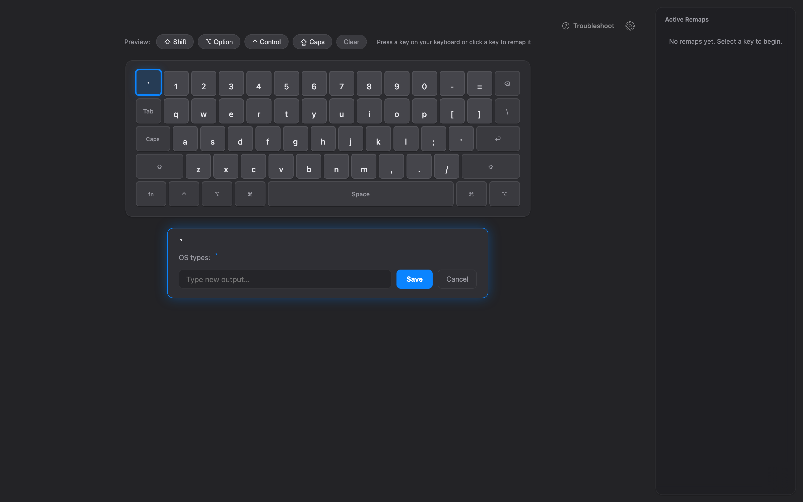

# KeyRemapper

A native-feeling macOS app for editing [Hammerspoon](https://www.hammerspoon.org) keyboard remaps — point, click, done. Click a key on the virtual keyboard (or press it physically), type what it should output, hit Save. Your remaps are written to `~/.hammerspoon/keyremaps.lua` and Hammerspoon reloads them automatically.



## Features

- Live virtual keyboard that matches your real macOS layout (ANSI/ISO/JIS, whatever's connected)
- Select keys with the mouse or by pressing them — modifier combos included
- Writes `hs.hotkey`-backed remaps to `~/.hammerspoon/keyremaps.lua` and reloads Hammerspoon automatically
- Apple-style light/dark UI with a System Settings-inspired look
- Guided onboarding when Hammerspoon isn't installed/configured yet, plus built-in troubleshooting videos
- Responsive layout: large keyboard + sidebar, compact keyboard + sidebar, or stacked on small windows

## Download

Grab the latest DMG from [Releases](../../releases/latest).

Requires a modern macOS and [Hammerspoon](https://www.hammerspoon.org) (the app walks you through installing it on first launch).

**Gatekeeper note:** this build isn't notarized, so on first launch macOS may block it. If so: **System Settings → Privacy & Security → Open Anyway**.

## Building from source

Requirements: Xcode Command Line Tools (`swiftc`) and Python 3 (bundled scripts target `/usr/bin/python3`).

```bash
cd codebase
./build.sh          # produces .build/KeyRemapper.app
./build_dmg.sh      # produces .build/KeyRemapper-1.0.dmg
```

The DMG background and app icon are generated by `generate_dmg_background.swift` and `generate_icon.swift`.

## How it works

- `KeyRemapperApp.swift` — a minimal Cocoa host: a borderless `WKWebView`, a `keyremapper://` scheme handler serving the bundled web UI, and an HTTP proxy that forwards `/api/*` calls to the local backend.
- `app.py` — a stdlib-only Python server on a dynamic localhost port. It reads the live keyboard layout via `keyboard_layout` (a tiny Swift helper), queries Hammerspoon install/config state, and writes `keyremaps.lua`.
- `static/` + `templates/` — the actual UI: keyboard rendering, remap editing, settings, onboarding, troubleshooting.

Changes are pushed to Hammerspoon with a `hs.reload()` IPC call, so remaps take effect immediately.
